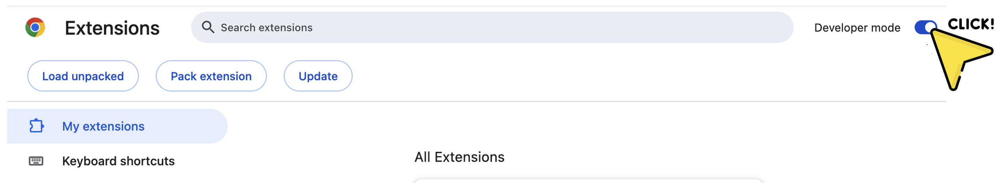
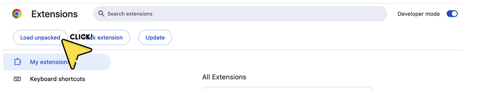

# FoodCensor

 

    

This repository is the Chrome Extension version of FoodCensor (*FoodCensor: Promoting Mindful Digital Food Content Consumption for People with Eating Disorders, ACM CHI'24*). This code can be adapted to censor YouTube videos on specific topics by modifying the keywords used to filter content based on textual descriptions (e.g., video titles). 

For more information about this project, please visit [https://nmsl.kaist.ac.kr/projects/foodcensor/](https://nmsl.kaist.ac.kr/projects/foodcensor/)

How to Build and Run
---------------------
### System Overview
FoodCensor is a stand-alone application that does not require a backend server. The app reads YouTube webpage on Google Chrome browser locally and overlays intervention screens.

### Prerequisites
- Google Chrome
- Developer mode enabled in Chrome (refer to Step 2.2 below)

### Steps to Build and Run

1. **Download the Repository**  
   - Download or clone this repository to your local machine.
2. **Load the Extension in Chrome**
   1. Open Chrome and navigate to `chrome://extensions/`.
   2. Enable **Developer mode** (toggle in the top right corner).  
      

          
      

   4. Click **Load unpacked** and select the project folder.
      

          
      

3. **Use the Extension**
   - FoodCensor will filter YouTube videos based on **both English and Korean food-related keywords.**

### Uninstallation
- Go to `chrome://extensions/`, find the **FoodCensor** extension, and click **Remove**.  

Related Research Papers
-----------------------
**FoodCensor: Promoting Mindful Digital Food Content Consumption for People with Eating Disorders**\
Ryuhaerang Choi, Subin Park, Sujin Han, and Sung-Ju Lee\
ACM CHI 2024 ([PDF](https://drive.google.com/file/d/1FwvhBpj6P_zRGltLUFfIUL3TAm9pPV9U/view))\
\
**How People with Eating Disorders Get Trapped in the Perpetual Cycle of Digital Food Content**\
Ryuhaerang Choi, Subin Park, Sujin Han, and Sung-Ju Lee\
([arXiv](https://arxiv.org/abs/2311.05920))

Research Team Members
---------------------
**Ryuhaerang Choi [:link:](https://ryuhaerang.github.io/ryuhaerangchoi/)**\
Ph.D. Student\
KAIST\
*Contact for code and implementation*\
\
**Subin park [:link:](https://bit.ly/subinp)**\
M.S. Student\
KAIST\
\
**Sujin Han [:link:](https://vilotgit.github.io)**\
M.S.-Ph.D. Integrated Student\
KAIST\
\
**Sung-Ju Lee [:link:](https://sites.google.com/site/wewantsj/)**\
Professor\
KAIST

Acknowledgement
---------------
This work was supported by the Institute of Information & commu- nications Technology Planning & Evaluation (IITP) grant funded by the Korean government (MSIT) (No. 2022-0-00064, Development of Human Digital Twin Technologies for Prediction and Management of Emotion Workers’ Mental Health Risks).
